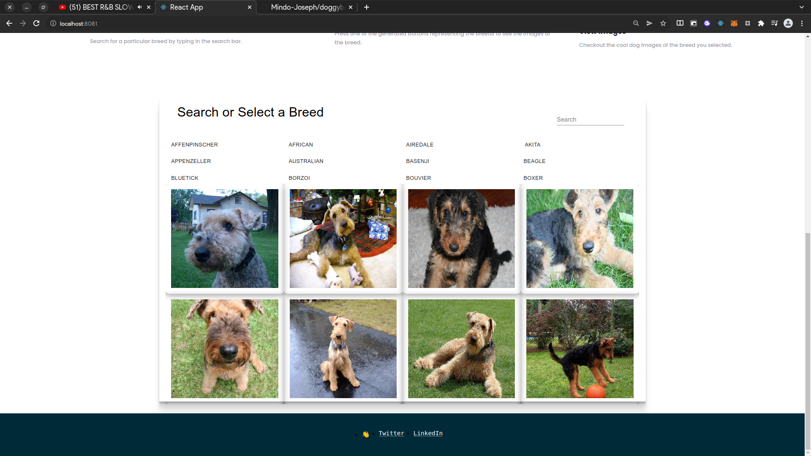

<br />
<p align="center">
  <a href="https://www.talanddev.com/">
    
  </a>

  <h2 align="center">Project: Dog Dashboard </h2>

  <p align="center">
    This project is part of tal&dev recruiting
  </p>
</p>

## About The Project

Dog Dashboard is a project that involves looking up various dogs based on breeds and displaying them in a dashboard.

<!-- INSTALLATION -->
## Installation

You need to have this app or tools to start using it:
* [NodeJS](https://nodejs.org/en/) 
* [React](https://reactjs.org/)
* Clone this repo  ```git clone https://github.com/Mindo-Joseph/doggyboard.git```
* Checkout to the development branch by ```git checkout develop```
* Open terminal and ```cd``` to the cloned folder and install gems with ```npm i```
* Run the server with ```npm start```

### Usage

Once you have started the server, visit the browser at `http://127.0.0.1:3000/`  

### Tests


### Live version

### Screenshots:





### Built With

* [TypeScript](https://www.typescriptlang.org/)
* [React](https://reactjs.org/):
* [Material-UI](https://material-ui.com/)

## Authors


👤 **Joseph Mindo**

- Github: [@MindoJoseph](https://github.com/Mindo-Joseph)
- Twitter: [@mindoJoseph](https://twitter.com/mindoJoseph)
- Linkedin: [Joseph Mindo](https://www.linkedin.com/in/josephmindo/)


## 🤝 Contributing

Contributions, issues and feature requests are welcome!

Feel free to check the [issues page](https://github.com/Mindo-Joseph/doggyboard/issues/).


## Acknowledgments

* [Tal&Dev](https://www.talanddev.com/)


## 📝 License

This project is [MIT](lic.url) licensed.


## Show your support

Give a ⭐️ if you like this project!
